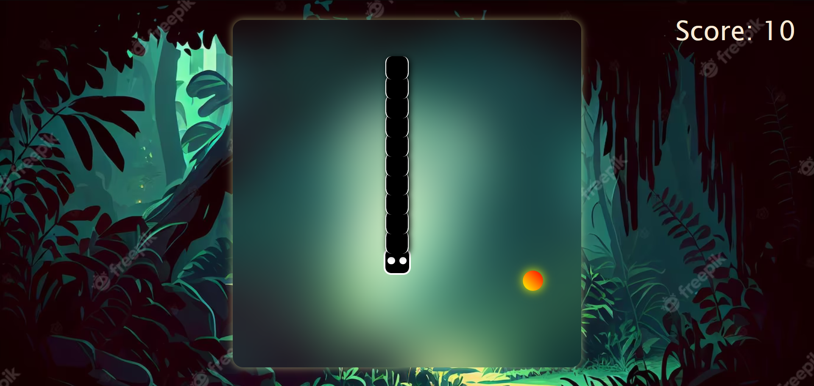

Snake Game Website

Welcome to the Snake Game Website, a fun and interactive project developed as part of a web development course. This web-based game allows users to enjoy the classic Snake Game experience while keeping track of their scores.

Features:

    Classic Gameplay: Play the timeless Snake Game directly in your browser.

    Score Tracking: Keep a record of your scores to challenge yourself and compete with friends.

    Responsive Design: The website is designed to be responsive, ensuring an enjoyable gaming experience on various devices.

    Easy to Use: Simple controls make it easy for users of all ages to jump in and start playing.

How to Play:

    Visit the website link.
    Use arrow keys to control the snake's direction.
    Collect food items to grow the snake and earn points.
    Avoid collisions with the snake's own body and the game borders.

Technologies Used:

    Frontend: HTML, CSS, JavaScript
    Scoring: Local Storage
    Version Control: Git, GitHub

Feel free to fork, contribute, or open issues. Have fun playing!